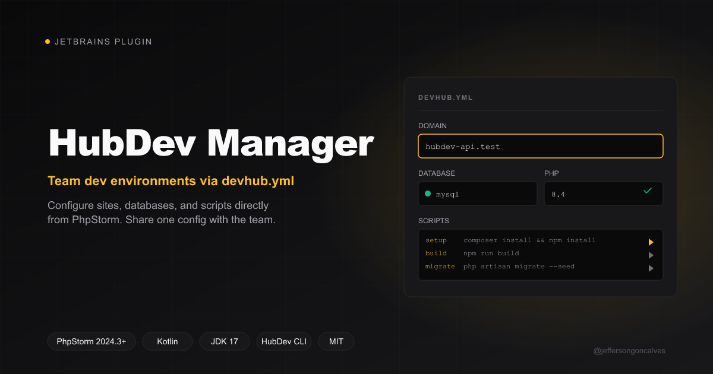

# HubDev Manager — PhpStorm Plugin



Manage [HubDev](https://hubdev.io) project configuration directly from PhpStorm. Create and share `devhub.yml` files so your entire team gets the same local development environment.

## Screenshots

> Coming soon

## Features

- **Auto-detection** — Detects HubDev CLI on Windows, macOS, and Linux
- **Project configuration** — Create and edit `devhub.yml` with site name, domain, PHP version, database, and scripts
- **Database setup** — Configure and create databases (MySQL, PostgreSQL, SQLite, SQL Server)
- **Script runner** — Define and run project scripts (setup, build, migrate, etc.) from the IDE
- **Site linking** — Link/unlink projects to HubDev with one click
- **SSL management** — Secure sites with HTTPS directly from the IDE
- **Status bar widget** — See link status at a glance in the IDE status bar
- **Tool window panel** — Full configuration UI in the right sidebar
- **Smart notifications** — Prompts to configure or link on project open
- **Reactive updates** — UI auto-refreshes when `devhub.yml` changes externally
- **Team sharing** — Commit `devhub.yml` to git so everyone uses the same config

## Requirements

- PhpStorm 2024.3+
- [HubDev CLI](https://hubdev.io) installed
- JDK 17+ (for building from source)

## Installation

### From JetBrains Marketplace

> Coming soon

### From Disk

1. Download the latest `.zip` from [Releases](https://github.com/jeffersongoncalves/hubdev-manager-plugin/releases)
2. In PhpStorm: **Settings → Plugins → ⚙️ → Install Plugin from Disk...**
3. Select the downloaded `.zip` file
4. Restart PhpStorm

## Usage

### Quick Start

1. Open a project in PhpStorm
2. The plugin auto-detects HubDev and checks for `devhub.yml`
3. If no config exists, a notification offers to **Configure Now**
4. Set your site name, domain, PHP version, database, and scripts
5. Click **Link Site** to register with HubDev

### Tool Window

Access via **View → Tool Windows → HubDev Manager** or the HubDev icon in the right sidebar.

| Section | Description |
|---------|-------------|
| **Status** | Shows linked/unlinked status and site URL |
| **Site Configuration** | Site name, domain, PHP version |
| **Database Configuration** | Driver, database name, username, password, create button |
| **Scripts** | Dynamic list of named scripts with run/add/remove |
| **Actions** | Save, Link, Unlink buttons |

### Actions Menu

Available under **Tools → HubDev**:

- **Configure Site** — Opens the tool window
- **Link Site** — Links the project to HubDev
- **Open in Browser** — Opens the site URL
- **Run Script...** — Shows a popup to choose and run a script

### Status Bar

The status bar widget shows the current link status. Click it to open the tool window.

### devhub.yml Example

```yaml
# HubDev Team Configuration
# Share this file with your team so everyone gets the same dev environment.
# Docs: https://hubdev.io

name: hubdev-api
domain: hubdev-api.test
php: "8.4"
database:
    driver: mysql
    name: hubdev_api
    user: root
    password: devhub123
scripts:
    setup: composer install && npm install
    build: npm run build
    migrate: php artisan migrate --seed
```

## Building from Source

```bash
git clone https://github.com/jeffersongoncalves/hubdev-manager-plugin.git
cd hubdev-manager-plugin
./gradlew buildPlugin
```

The plugin `.zip` will be in `build/distributions/`.

## License

MIT License. See [LICENSE](LICENSE) for details.

## Author

**Jefferson Goncalves**
- GitHub: [@jeffersongoncalves](https://github.com/jeffersongoncalves)
- Email: jefferson@jeffersongoncalves.com
